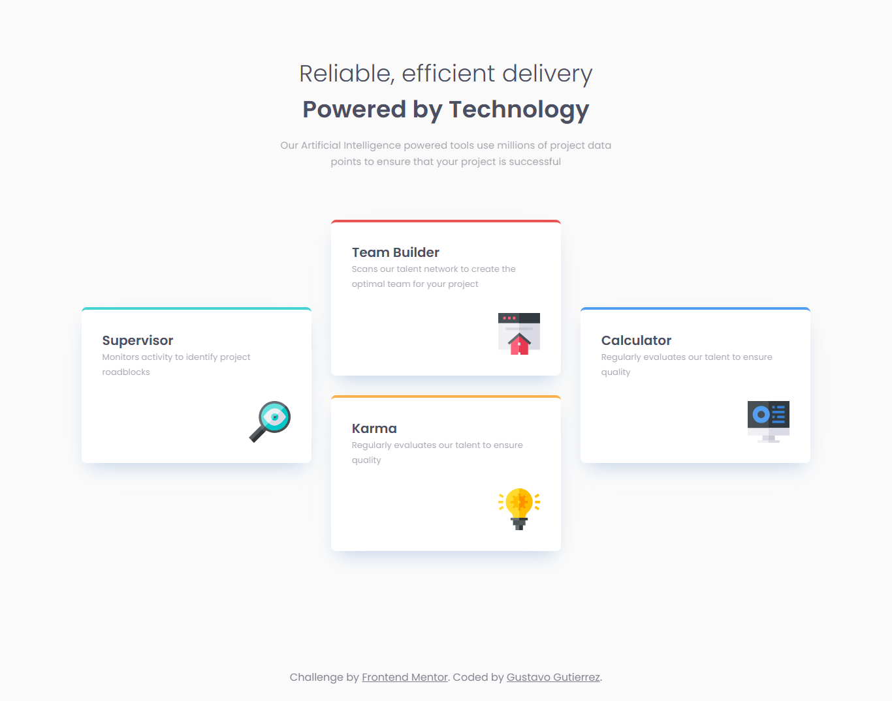

# Frontend Mentor - Four card feature section solution

This is a solution to the [Four card feature section challenge on Frontend Mentor](https://www.frontendmentor.io/challenges/four-card-feature-section-weK1eFYK). Frontend Mentor challenges help you improve your coding skills by building realistic projects.

## Table of contents

- [Overview](#overview)
  - [The challenge](#the-challenge)
  - [Screenshot](#screenshot)
  - [Links](#links)
- [My process](#my-process)
  - [Built with](#built-with)
  - [What I learned](#what-i-learned)
- [Author](#author)

## Overview

### The challenge

Users should be able to:

- View the optimal layout for the site depending on their device's screen size

### Screenshot

### Links

- Solution URL: [Frontend Mentor Challenge Solution](https://www.frontendmentor.io/solutions/responsive-four-card-feature-section-ypBSggvyOg)
- Live Site URL: [Four Card Feature Section](https://gustavo2023.github.io/four-card-feature-section/)

## My process

### Built with

- Semantic HTML5 markup
- CSS custom properties
- Flexbox
- CSS Grid
- Mobile-first workflow

### What I learned

- Implemented a responsive layout using CSS Grid and Flexbox to ensure the site looks good on both mobile and desktop devices.

- Gained a deeper understanding of CSS Grid for creating complex layouts.

- Learned the differneces between using inline SVGs and external SVGs, and opted for external SVGs to keep the HTML clean and leverage browser caching.

## Author

- Frontend Mentor - [@gustavo2023](https://www.frontendmentor.io/profile/gustavo2023)
